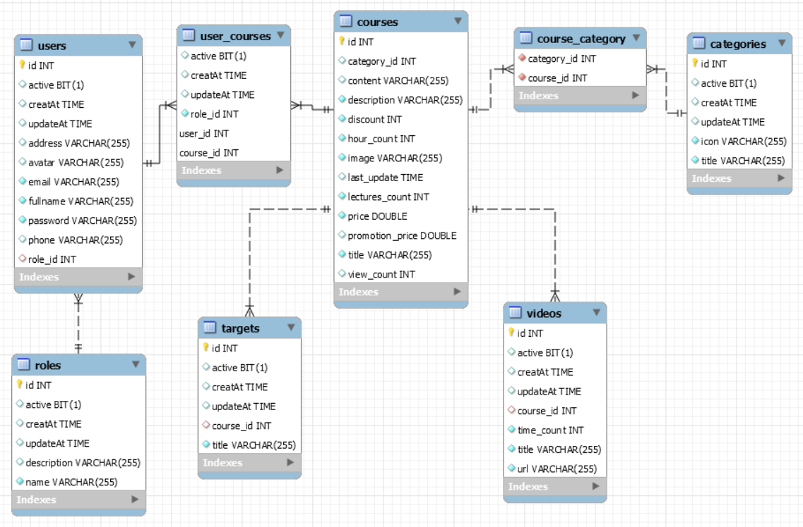

# Dự án ELEARNING

## Yêu Cầu

### Yêu Cầu Hệ Thống

- **Quản lý khóa học:** Quản lý các thông tin như tên khóa học, mô tả, hình ảnh, lượt xem, người tạo, ngày tạo,…
- **Quản lý thành viên:** Quản lý các thông tin như tài khoản, mật khẩu, họ tên, email, số điện thoại, loại thành viên.

## Phân Tích

### Actor

- **Học viên(user):** Những người muốn ghi danh vào khóa học của trung tâm.

- **Giáo vụ(teacher):** Những người upload khóa học và quản lý thành viên của khóa học của họ.

- **Quản trị viên (admin):** Những người quản lý tất cả thành viên và khóa học của hệ thống.

### Use Case

**Học viên(user)**

- Xem trang chủ
- Tìm kiếm khóa học
- Xem khóa học
- Ghi danh vào khóa học
- Quản lý khóa học đã được ghi danh
- Đăng ký tài khoản
- Đăng nhập
- Quản lý tài khoản cá nhân

**Giáo vụ(teacher)**

- Đăng ký tài khoản
- Đăng nhập
- Quản lý tài khoản cá nhân
- Upload khóa học
- Quản lý khóa học
- Quản lý thành viên của khóa học

**Quản trị viên(admin)**

- Quản lý tất cả thành viên
- Quản lý tất cả khóa học

## Database

